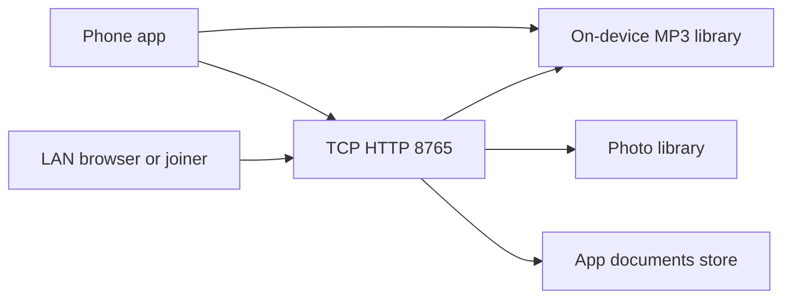

# 000 — Architecture snapshot

- **Repo:** `musicPlayer` (GitHub: `noowxela/lan-media-player`; on-device name **Music Player**)
- **Status:** current
- **Date:** 2026-09-09
- **Bundle id:** `com.alexwoon.musicplayer`

## What it is

Expo iOS (and Android-capable) app: local MP3 library with background playback, plus a same-Wi-Fi HTTP share. A phone hosts on port **8765**; a computer opens the URL, or another phone joins from Transfer.

**Expo Go is not enough.** Native modules (`react-native-tcp-socket`, `expo-media-library`, camera) need a development build (`npx expo run:ios`).

## Stack

| Layer | Choice |
| --- | --- |
| App | Expo SDK 57, Expo Router, React 19, RN 0.86, TypeScript |
| Audio | `expo-audio` (background playback, lock screen) |
| LAN HTTP | `react-native-tcp-socket` in `src/lib/lan-server.ts` (`LAN_PORT = 8765`) |
| Media | `expo-media-library` (photos/videos), `expo-video-thumbnails` / `expo-image-manipulator` in JS only |
| Join | `expo-camera` QR scan; PIN + Accept on host |
| UI | Native tabs (`src/components/app-tabs.tsx`) |
| iOS widget | `expo-widgets` **Now Playing** (`widgets/NowPlayingWidget.tsx`). Live data needs a paid Apple Developer account (App Groups). Free Apple ID: `plugins/with-personal-team-signing.js` |

Do **not** add `expo-image-manipulator` or `expo-video-thumbnails` to the `plugins` array in `app.json` (no config plugin; prebuild crashes). Photos/videos need a native rebuild after those packages were added.

## Surfaces

| Tab / route | Role |
| --- | --- |
| Library (`src/app/index.tsx`) | Import MP3s, play, multi-select, delete |
| Now Playing (`src/app/player.tsx`) | Seek, prev/pause/next, loop |
| Transfer (`src/app/transfer.tsx`) | Host (QR + PIN, Accept/Decline) or join (IP + PIN or scan) |
| Settings (`src/app/settings.tsx`) | On-device library folder (Files: On My iPhone → Music Player → music) |
| iOS Home Screen widget | **Now Playing** (`widgets/NowPlayingWidget.tsx`); needs a native rebuild |

LAN browser (served from the phone): Home, Photos, Videos, Music, Documents. Home drag-and-drop: MP3s → Music, other files → Documents. Photos/videos come from the device library (Camera vs Gallery albums). Documents are **app-stored files**, not a full Files-app clone of the phone.

## Data flow

- Playback state: `src/lib/player-context.tsx` (`MusicProvider` in `src/app/_layout.tsx`). Incoming LAN MP3 uploads notify the player via `subscribeIncomingUploads`.
- Host HTML/JS is a template string in `src/lib/host-page.ts` (plus PIN error / waiting pages).
- Access: PIN on the URL; new clients wait until the phone **Accept**s. Reload after leaving the LAN page can reconnect without a second prompt. **Disconnect** on the phone requires Accept again. PIN changes each time sharing starts.
- The HTTP server lives in the JS process. **Transfer must stay open** while sharing. Stop sharing drops every browser session.

## Pros

- One device is both player and share hub; no cloud account.
- PIN + Accept is enough for a trusted LAN.
- Native audio + photo library APIs match a real phone workflow.

## Cons / risks

- Guest Wi-Fi that isolates clients will fail.
- No HTTPS / Bonjour; HTTP on the LAN only (`NSAllowsLocalNetworking`).
- Share dies if the Transfer screen is left or the JS runtime suspends.
- Giant `host-page.ts` / `lan-server.ts` files; edits to LAN UI collide easily.
- iOS Photos permission is required for photo/video share; deleting from the LAN page can delete library assets.

## Do not change in this snapshot

New cloud sync, HTTPS reverse proxy, or turning Documents into a full Files-app clone. Those need a numbered change SDD after questions and approval.
